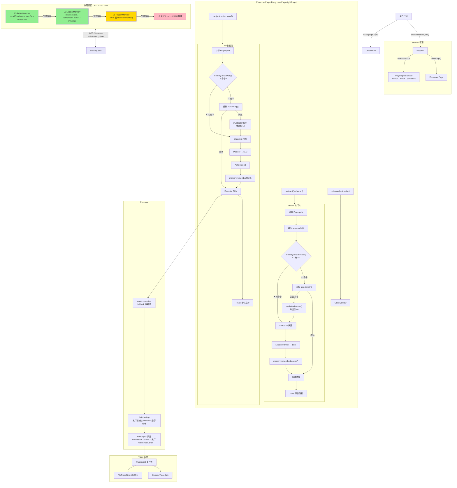

# browser-auto v0.1 架构设计文档

> 基于 [v0.1-prompt.md](../v0.1-prompt.md) 的 Step 1 产出，经技术评审后定稿。
> 评审结论：方向可行，分层记忆 + 降级链 + 结构化 Trace 为核心的架构是扎实的。

---

## 1. 核心 API 完整 TS 签名

### 1.1 主入口 `createSession`

```ts
import { chromium, Browser, BrowserContext } from "playwright";
import { z } from "zod";

// === 浏览器配置 ===

type BrowserConfig =
  | { mode: "launch"; engine: typeof chromium; options?: LaunchOptions }
  | { mode: "attach"; cdpEndpoint: string }
  | { mode: "persistent"; userDataDir: string; options?: LaunchOptions };

// === LLM 配置 ===

type LLMProvider = "openai" | "anthropic" | "deepseek";

type LLMConfig = {
  provider: LLMProvider;
  model: string;
  apiKey: string;
  baseURL?: string; // DeepSeek 等兼容端点
};

// === 内存配置 ===

type MemoryConfig = {
  enabled: boolean;
  path: string; // 默认 ./.browser-auto/memory.json
};

// === 策略配置 (v0.1 留接口，不实现) ===

type PolicyConfig = {
  policies: BeforeActionInterceptor[];
};

// === Trace 配置 (v0.1 提供 Console + File sink) ===

type TraceConfig = {
  sinks: TraceSink[];
};

// === Session 创建 ===

type CreateSessionOptions = {
  browser: BrowserConfig;
  llm: LLMConfig;
  memory?: MemoryConfig;
  policies?: BeforeActionInterceptor[]; // v0.1 留接口
  trace?: TraceSink[]; // v0.1 默认 console
};

type Session = {
  newPage(): Promise<EnhancedPage>;
  close(): Promise<void>;
  getStats(): SessionStats;
};

declare function createSession(opts: CreateSessionOptions): Promise<Session>;
```

### 1.2 快捷方式 `wrap`

```ts
import type { Page } from "playwright";

type WrapOptions = {
  llm: LLMConfig;
  memory?: MemoryConfig;
};

declare function wrap(page: Page, opts: WrapOptions): EnhancedPage;
```

`wrap` 等价于 `createSession({ browser: { mode: 'attach-page', page }, ... })`。

### 1.3 EnhancedPage

```ts
type EnhancedPage = Page & {
  /** 执行动作（点击/输入/按键等），走 L3→L0 降级链 */
  act(instruction: string, vars?: Record<string, string>): Promise<void>;

  /** 提取结构化数据，走 L2→L0 降级链 */
  extract<T>(opts: { schema: z.ZodType<T>; instruction?: string }): Promise<T>;

  /** 观察页面上符合描述的交互节点 */
  observe(instruction: string): Promise<NodeRef[]>;
};
```

实现方式：`Proxy` 把三个方法叠加到原生 `Page` 上，其余属性/方法 `Reflect.get` 透传。特别注意 Playwright Page 内部使用 Symbol 属性，Proxy handler 中对 `typeof key === 'symbol'` 直接透传不处理。

---

## 2. 核心类型定义

### 2.1 ActionStep

```ts
type ActionStep =
  | { kind: "click"; target: NodeRef }
  | { kind: "fill"; target: NodeRef; value: string | { var: string } }
  | { kind: "press"; key: string }
  | { kind: "select"; target: NodeRef; value: string }
  | { kind: "hover"; target: NodeRef }
  | {
      kind: "wait";
      condition: "idle" | "visible" | "timeout";
      target?: NodeRef;
      ms?: number;
    };

type NodeRef = {
  role: string; // a11y role: button / link / textbox / combobox / checkbox / menuitem / tab / menu
  name: string; // accessible name（可能为变量占位符）
  selectors: string[]; // 多候选 fallback 链，LLM 同时产出语义 selector + 结构 selector
};
```

### 2.2 Memory 接口

```ts
interface Memory {
  // L3: act 整套路径缓存
  recallPlan(instruction: string, fp: string): ActionStep[] | null;
  rememberPlan(instruction: string, fp: string, plan: ActionStep[]): void;
  invalidatePlan(instruction: string, fp: string): void;

  // L2: 单节点 selector 缓存
  recallLocator(semanticKey: string, fp: string): LocatorEntry | null;
  rememberLocator(semanticKey: string, fp: string, entry: LocatorEntry): void;
  invalidateLocator(semanticKey: string, fp: string): void;

  // L1: 区域占位，v0.1 抛 NotImplementedError
  recallRegion(semanticKey: string, fp: string): RegionEntry | null;
  rememberRegion(semanticKey: string, fp: string, entry: RegionEntry): void;
}

type LocatorEntry = {
  selectors: string[]; // fallback 候选链表，至少含一条语义 selector + 一条结构 selector
  hint?: string; // 自然语言描述，方便人工读 memory.json 时理解
  selectorHits: number[]; // 每个候选命中次数，运行时统计反馈选择器质量
  successCount: number;
  failCount: number;
};

type RegionEntry = {
  rootSelector: string;
  hint?: string;
};
```

### 2.3 Fingerprint 类型

```ts
type Fingerprint = {
  url: string;
  domHash: string; // sha256 of role+name+parentChain
  domSummary: string; // 压缩版：form>input.user,input.pwd,button.submit
};

type InteractiveNode = {
  role: string;
  name: string;
  parentChain: string[]; // 祖先 role 列表
  attributes: Record<string, string>; // aria-label, data-testid, placeholder 等
};
```

**指纹关键设计决策**：

- 基于 Playwright `page.accessibility.snapshot()` 而非 raw HTML
- 动态值（如「订单 #12345」）在上层做变量化处理后填入 `name`
- `domSummary` 作为第二因子，防止不同页面 a11y 标记残缺时 hash 碰撞

### 2.4 Trace 事件

```ts
type TraceEvent =
  | {
      type: "act.start";
      sessionId: string;
      pageId: string;
      instruction: string;
      ts: number;
    }
  | {
      type: "memory.hit";
      sessionId: string;
      layer: "L3" | "L2" | "L1";
      key: string;
      ts: number;
    }
  | {
      type: "memory.miss";
      sessionId: string;
      layer: "L3" | "L2" | "L1";
      key: string;
      ts: number;
    }
  | {
      type: "memory.invalidate";
      sessionId: string;
      layer: "L3" | "L2" | "L1";
      key: string;
      reason: string;
      ts: number;
    }
  | {
      type: "memory.write";
      sessionId: string;
      layer: "L3" | "L2" | "L1";
      key: string;
      ts: number;
    }
  | {
      type: "llm.request";
      sessionId: string;
      snapshotSize: number;
      model: string;
      ts: number;
    }
  | {
      type: "llm.response";
      sessionId: string;
      plan: ActionStep[];
      usage: { promptTokens: number; completionTokens: number };
      ts: number;
    }
  | {
      type: "step.start";
      sessionId: string;
      step: ActionStep;
      attempt: number;
      ts: number;
    }
  | {
      type: "step.success";
      sessionId: string;
      step: ActionStep;
      selectorIndex: number;
      ts: number;
    }
  | {
      type: "step.fail";
      sessionId: string;
      step: ActionStep;
      error: string;
      ts: number;
    }
  | {
      type: "act.end";
      sessionId: string;
      success: boolean;
      durationMs: number;
      ts: number;
    }
  | {
      type: "extract.start";
      sessionId: string;
      pageId: string;
      schemaFields: string[];
      ts: number;
    }
  | {
      type: "extract.end";
      sessionId: string;
      success: boolean;
      durationMs: number;
      ts: number;
    }
  | {
      type: "observe.start";
      sessionId: string;
      pageId: string;
      instruction: string;
      ts: number;
    }
  | {
      type: "observe.end";
      sessionId: string;
      success: boolean;
      nodeCount: number;
      durationMs: number;
      ts: number;
    };

interface TraceSink {
  write(event: TraceEvent): Promise<void>;
}
```

**事件链示例**：

L3 命中场景（最短路径）：

```
act.start → memory.hit(L3) → step.start × N → step.success × N → act.end
```

L0 首次执行场景（最长路径）：

```
act.start → memory.miss(L3) → llm.request → llm.response → memory.write(L3)
  → step.start × N → step.success × N → act.end
```

### 2.5 拦截器接口（v0.1 只定义，不实现）

```ts
interface ActionHook {
  /** action 执行前调用；返回 { abort: true, reason } 可终止 */
  before?(ctx: ActionContext): Promise<void | { abort: true; reason: string }>;
  /** action 执行后调用 */
  after?(ctx: ActionContext, result: ActionResult): Promise<void>;
}

type ActionContext = {
  sessionId: string;
  page: Page;
  step: ActionStep;
  instruction: string;
};

type ActionResult = {
  success: boolean;
  selectorIndex: number; // -1 表示全部失败
  durationMs: number;
  error?: Error;
};
```

**设计决策**：v0.1 合并为一个 `ActionHook` 接口（含可选的 `before` + `after`），而非拆成两个独立接口。v0.4 真正需要时再根据实际 policy 类型细化绑责。

### 2.6 SnapshotStrategy

```ts
interface SnapshotStrategy {
  name: string;
  /** 提取交互节点；region 参数为 v0.3 L1 子树裁剪预留，v0.1 不传 */
  getInteractiveNodes(page: Page, region?: NodeRef): Promise<InteractiveNode[]>;
  /** 从节点列表生成稳定指纹 */
  fingerprint(nodes: InteractiveNode[]): string;
}
```

---

## 3. memory.json 完整 Schema 设计

### 3.1 文件结构

```jsonc
{
  "version": 1,
  "actions": [
    // L3 — act 路径缓存。每条是一个完整的 ActionStep[] 快照
    {
      "id": "act_8f3a1b2c",
      "instruction": "在用户名输入框填入 ${username}",
      "fingerprint": {
        "url": "https://example.com/login",
        "domHash": "sha256:a1b2c3d4e5f6...",
        "domSummary": "form>textbox.username,textbox.pwd,button.submit",
      },
      "plan": [
        {
          "kind": "fill",
          "target": {
            "role": "textbox",
            "name": "用户名",
            "selectors": [
              "[data-testid='username']",
              "input[name='username']",
              ".login-form input[type='text']",
            ],
          },
          "value": { "var": "username" },
        },
        {
          "kind": "fill",
          "target": {
            "role": "textbox",
            "name": "密码",
            "selectors": ["[data-testid='password']", "input[name='password']"],
          },
          "value": { "var": "password" },
        },
        {
          "kind": "click",
          "target": {
            "role": "button",
            "name": "登录",
            "selectors": [
              "[data-testid='login-btn']",
              "button.submit",
              "button[type='submit']",
            ],
          },
        },
      ],
      "stats": {
        "createdAt": "2026-05-03T10:00:00Z",
        "lastUsedAt": "2026-05-03T10:05:00Z",
        "hitCount": 3,
        "fallbackCount": 0,
      },
    },
  ],
  "locators": [
    // L2 — extract 节点映射。每条是一个语义 key → selector 链的映射
    {
      "id": "loc_7b2e3d4f",
      "semanticKey": "extract:title",
      "fingerprint": {
        "url": "https://example.com/products",
        "domHash": "sha256:d4e5f6a7b8...",
        "domSummary": "main>.product-list>h2.title,span.price,button.buy",
      },
      "entry": {
        "selectors": [
          ".product h2",
          "[data-testid='title']",
          "h2.product-title",
        ],
        "hint": "商品标题",
        "selectorHits": [5, 0, 0],
        "successCount": 5,
        "failCount": 0,
      },
    },
    {
      "id": "loc_9c0d1e2f",
      "semanticKey": "extract:price",
      "fingerprint": {
        "url": "https://example.com/products",
        "domHash": "sha256:d4e5f6a7b8...",
      },
      "entry": {
        "selectors": [".product .price", "[data-testid='price']", "span.price"],
        "hint": "商品价格",
        "selectorHits": [3, 0, 0],
        "successCount": 3,
        "failCount": 0,
      },
    },
  ],
  "regions": [
    // L1 — v0.1 永远为空，数据结构预留给 v0.3
  ],
}
```

### 3.2 Zod Schema（代码层校验）

```ts
import { z } from "zod";

const ActionStepSchema = z.discriminatedUnion("kind", [
  z.object({ kind: z.literal("click"), target: NodeRefSchema }),
  z.object({
    kind: z.literal("fill"),
    target: NodeRefSchema,
    value: z.union([z.string(), z.object({ var: z.string() })]),
  }),
  z.object({ kind: z.literal("press"), key: z.string() }),
  z.object({
    kind: z.literal("select"),
    target: NodeRefSchema,
    value: z.string(),
  }),
  z.object({ kind: z.literal("hover"), target: NodeRefSchema }),
  z.object({
    kind: z.literal("wait"),
    condition: z.enum(["idle", "visible", "timeout"]),
    target: NodeRefSchema.optional(),
    ms: z.number().optional(),
  }),
]);

const MemoryFileSchema = z.object({
  version: z.literal(1),
  actions: z.array(ActionEntrySchema),
  locators: z.array(LocatorEntrySchema),
  regions: z.array(RegionEntrySchema),
});
```

### 3.3 人工可读可改的设计意图

用户可以直接编辑 `memory.json`：

- 修改 `selectors` 数组 → 下次执行生效（替换 LLM 产出的低质量 selector）
- 删除某条 `actions[n]` / `locators[n]` → 删缓存，强制重走 LLM
- 改 `hint` 不影响功能，只影响可读性

这是相对于 Stagehand 不透明缓存的差异化设计。

---

## 4. LLM 提示词模板草稿

> 提示词模板根据 LLM provider 动态选编：OpenAI 用 few-shot 示例，DeepSeek 用更显式的格式约束。
> 模板集中放在 `src/llm/prompts/`。

### 4.1 act 系统提示词

```
你是一个浏览器自动化助手。根据页面快照，将用户的自然语言指令转化为 Playwright 可执行的结构化操作步骤。

## 输出格式
返回 JSON 数组，每个元素是一个操作步骤，包含以下字段：
- kind: "click" | "fill" | "press" | "select" | "hover" | "wait"
- target.role: a11y role（button / link / textbox / combobox / checkbox / menuitem / tab / menu）
- target.name: 元素的可访问名称
- target.selectors: 候选 CSS selector 列表（按优先级排列），至少包含一条语义选择器（如 [aria-label="xxx"]）和一条结构选择器（如 .class > element）
- value: 仅 fill 需要，字符串或 { var: "变量名" }

## 选择器策略
1. 首选 data-testid
2. 次选 aria-label / role + name
3. 再次结构选择器（.class > element）
4. 避免 nth-child / 位置选择器
5. 变量占位用 ${varName} 格式

## 页面快照格式
每个节点格式: [role] name (parentChain: parent1>parent2) selectors: css1, css2, ...

## 示例
用户: "在搜索框输入手机，点击搜索按钮"
快照:
[textbox] 搜索 (main>form>div) selectors: [data-testid='search'], input.search-input
[button] 搜索 (main>form>div) selectors: [data-testid='search-btn'], button.search-btn

输出:
[
  {
    "kind": "fill",
    "target": {
      "role": "textbox",
      "name": "搜索",
      "selectors": ["[data-testid='search']", "input.search-input"]
    },
    "value": "手机"
  },
  {
    "kind": "click",
    "target": {
      "role": "button",
      "name": "搜索",
      "selectors": ["[data-testid='search-btn']", "button.search-btn"]
    }
  }
]
```

### 4.2 extract 系统提示词

```
你是一个数据提取助手。根据页面快照和用户想要提取的字段，为每个字段找到对应的 DOM 节点选择器。

## 输出格式
返回 JSON 对象，key 是字段名，value 是：
{
  "selectors": ["首选", "备选1", "备选2"],
  "hint": "该字段的中文描述"
}

## 注意事项
- 优先匹配表单 label 文本、表格列头、卡片标题
- 选择器避免 nth-child
- 如果找不到对应节点，selectors 为空数组

## 页面快照格式
[role] name (parentChain) selectors: css1, css2, ...

## 示例
用户要提取: ["商品标题", "价格", "库存状态"]
快照:
[heading] iPhone 15 Pro (main>.product-detail) selectors: [data-testid='product-title'], h1.title
[text] ¥8999 (main>.product-detail) selectors: [data-testid='price'], span.price
[text] 有货 (main>.product-detail) selectors: [data-testid='stock'], span.stock-status

输出:
{
  "商品标题": {
    "selectors": ["[data-testid='product-title']", "h1.title"],
    "hint": "商品标题"
  },
  "价格": {
    "selectors": ["[data-testid='price']", "span.price"],
    "hint": "商品价格"
  },
  "库存状态": {
    "selectors": ["[data-testid='stock']", "span.stock-status"],
    "hint": "库存状态"
  }
}
```

### 4.3 observe 系统提示词

```
你是一个页面观察助手。根据页面快照和用户的语义描述，找出页面上所有符合描述的交互节点。

## 输出格式
返回 JSON 数组，每个元素是:
{
  "role": "a11y role",
  "name": "accessible name",
  "selectors": ["首选", "备选1"]
}

## 示例
用户: "页面上所有可点击的菜单项"
快照:
[menuitem] 订单管理 (nav>ul) selectors: [data-testid='menu-orders'], li:nth-child(1)>a
[menuitem] 商品管理 (nav>ul) selectors: [data-testid='menu-products'], li:nth-child(2)>a
[button] 退出登录 (nav) selectors: [data-testid='logout'], button.logout

输出:
[
  { "role": "menuitem", "name": "订单管理", "selectors": ["[data-testid='menu-orders']", "li:nth-child(1)>a"] },
  { "role": "menuitem", "name": "商品管理", "selectors": ["[data-testid='menu-products']", "li:nth-child(2)>a"] }
]
```

---

## 5. 7 个钩子代码体现清单

| #   | 钩子名称                | v0.1 状态 | 代码体现                                                     | 文件路径                      |
| --- | ----------------------- | --------- | ------------------------------------------------------------ | ----------------------------- |
| 1   | 分层记忆文件可读可改    | ✅ 实现   | MemoryFileSchema (zod) + 三段式 JSON 结构                    | `src/memory/schema.ts`        |
| 2   | 页面指纹                | ✅ 实现   | A11ySnapshotStrategy.getInteractiveNodes + fingerprint()     | `src/snapshot/a11y.ts`        |
| 3   | SnapshotStrategy 可插拔 | ✅ 接口   | SnapshotStrategy interface + region 参数预留                 | `src/snapshot/index.ts`       |
| 4   | Self-healing            | ✅ 实现   | executor 执行前 `exists()` 校验 → 失败 invalidate → fallback | `src/executor/index.ts`       |
| 5   | ActionHook 拦截器       | 🔌 接口   | ActionHook interface (before/after optional) + executor 调度 | `src/executor/interceptor.ts` |
| 6   | 结构化 Trace 事件流     | ✅ 实现   | TraceEvent union type + TraceSink + ConsoleSink + FileSink   | `src/trace/index.ts`          |
| 7   | Daemon-ready (attach)   | ✅ 实现   | createSession browser.mode = 'attach' → connectOverCDP       | `src/session.ts`              |

---

## 6. 数据流图（Mermaid）



---

## 7. 目录结构与模块职责

```
browser-auto/
├── src/
│   ├── index.ts                  # 导出 createSession + 所有公共类型
│   ├── quick.ts                  # 导出 wrap 快捷方式
│   ├── session.ts               # Session 类：浏览器生命周期 + 页面管理
│   ├── page.ts                   # EnhancedPage Proxy 工厂
│   ├── types.ts                  # 所有公共类型（ActionStep, NodeRef, Fingerprint...）
│   ├── debug.ts                  # debug 包封装，namespace: browser-auto:*
│   │
│   ├── memory/
│   │   ├── index.ts              # Memory 接口导出
│   │   ├── file-memory.ts        # Memory 接口默认文件实现（三段式读写、统计更新）
│   │   ├── action-memory.ts      # L3 ActionMemory 实现
│   │   ├── locator-memory.ts     # L2 LocatorMemory 实现
│   │   ├── region-memory.ts      # L1 占位（抛 NotImplementedError）
│   │   ├── fingerprint.ts        # a11y 快照 → 指纹（变量化处理 + domSummary）
│   │   └── schema.ts             # memory.json 的 zod schema（校验 + 文档）
│   │
│   ├── llm/
│   │   ├── index.ts              # LLM 调用接口
│   │   ├── provider.ts           # ai-sdk provider 适配（OpenAI / DeepSeek / Anthropic）
│   │   └── prompts/
│   │       ├── act.ts            # act 提示词模板（含 provider 选编逻辑）
│   │       ├── extract.ts        # extract 提示词模板
│   │       └── observe.ts        # observe 提示词模板
│   │
│   ├── snapshot/
│   │   ├── index.ts              # SnapshotStrategy 接口
│   │   └── a11y.ts               # A11ySnapshotStrategy 默认实现
│   │
│   ├── planner/
│   │   ├── index.ts              # LLM → ActionStep[] 规划器
│   │   └── locator-planner.ts    # LLM → LocatorEntry 规划器（给 extract 用）
│   │
│   ├── executor/
│   │   ├── index.ts              # ActionStep[] → Playwright 执行（降级链入口）
│   │   ├── selector-resolver.ts  # selectors fallback 链尝试逻辑
│   │   └── interceptor.ts        # ActionHook 调度（before → execute → after）
│   │
│   └── trace/
│       ├── index.ts              # TraceEvent + TraceSink 接口
│       ├── console-sink.ts       # ConsoleTraceSink（debug 输出）
│       └── file-sink.ts          # FileTraceSink（JSONL 写入）
│
├── tests/
│   ├── fixtures/
│   │   ├── login.html            # act 测试用登录页面
│   │   └── product-list.html     # extract 测试用商品列表
│   ├── memory.action.test.ts     # L3 命中/失效/统计更新
│   ├── memory.locator.test.ts    # L2 命中/失效/selector 质量
│   ├── fingerprint.test.ts       # 指纹稳定性（同页同 hash，顺序无关）
│   ├── selector-resolver.test.ts # fallback 链首选/次选/全失败
│   ├── interceptor.test.ts       # Hook 调用顺序 + abort 终止
│   ├── trace.test.ts             # 事件链完整性
│   └── integration.test.ts       # 端到端，真起 Chromium
│
├── examples/
│   ├── 01-basic-act.ts           # 第二次 act 不调 LLM（L3 命中验证）
│   ├── 02-with-variables.ts      # 变量替换仍命中 L3
│   ├── 03-extract-cached.ts      # 第二次 extract 不调 LLM（L2 命中验证）
│   ├── 04-attach-cdp.ts          # connectOverCDP 接管已有 Chrome
│   └── 05-custom-snapshot.ts     # 自定义 SnapshotStrategy 注入
│
├── docs/
│   ├── v0.1/
│   │   └── architecture.md       # 本文件
│   ├── v0.1-prompt.md
│   └── roadmap.md
│
├── package.json
├── tsconfig.json
├── tsup.config.ts
├── biome.json
├── vitest.config.ts
├── .gitignore
├── .env.example
└── README.md
```

---

## 8. 技术风险与缓解措施

| 风险                                  | 影响                            | 缓解措施                                                                 |
| ------------------------------------- | ------------------------------- | ------------------------------------------------------------------------ |
| a11y 标记残缺导致指纹碰撞             | 缓存命中错误页面 → 执行错误流程 | `domSummary` 作指纹第二因子；self-healing 执行前校验 role+name           |
| 动态 name（如订单号）导致指纹永不命中 | L3/L2 缓存完全无效              | 上层做 name 变量化（`/\d+/g` → `${num}` 占位）后再 hash                  |
| DeepSeek 结构输出不稳定               | extract 返回格式错误            | `ai-sdk` 的 `generateObject` 内置重试；提示词用显式格式约束而非 few-shot |
| Playwright Page Proxy 拦截内部 Symbol | 页面操作异常                    | Proxy handler 对 `typeof key === 'symbol'` 直接透传                      |
| tsup 打包 Playwright 原生模块         | 构建失败                        | `tsup.config.ts` 将 playwright 全家桶 + ai-sdk 标记为 external           |
| 单 memory.json 多 session 并发写      | 数据竞争损坏文件                | v0.1 忽略（单 session 场景为主），v0.2 加文件锁                          |

---

## 9. 实施流程

已全面定义在 [v0.1-prompt.md](../v0.1-prompt.md) 第 10 节。8 个 Step 严格顺序推进：

1. 本架构文档（已完成）
2. 脚手架 + 类型 + 空实现
3. Memory + Fingerprint（先单测后实现）
4. Snapshot strategy + Planner（LLM 用 mock）
5. Executor + Selector resolver + Interceptor 调度
6. Trace（Console + File sink）
7. 串起来跑 5 个 examples
8. README + 收尾

每个 Step 完成后跑测试再往下。
